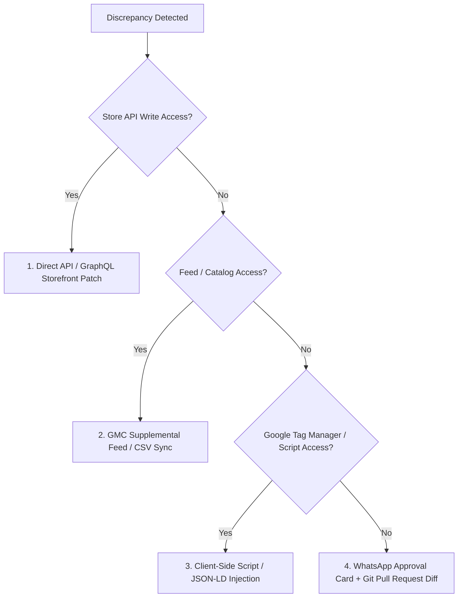

# SANOCEA SEO Stack — Commercial Credibility Gap Report
**Hostile Client Audit: Head of Ecommerce & CTO Evaluation**

**Date:** 2026-09-29  
**Auditor Perspective:** Skeptical Enterprise CTO / VP of Ecommerce evaluating `@sanocea/seo-stack`  
**Test Subjects:**
1. `https://www.sanocea.com/` (SPA React site / Static pre-hydration shell)
2. `https://shop.waaree.com/` (Custom PHP enterprise solar storefront)
3. `https://carzex.com/` (WordPress / WooCommerce D2C automotive accessories)

---

## Executive Verdict: "Impressive Primitives, Fatal Vulnerabilities"

The SANOCEA SEO Stack has successfully transitioned beyond basic open-source crawlers. Its core insight—unifying **Track A (Technical SEO)** with **Track B (Ecommerce Operations Intelligence)** and tying DOM discrepancies to physical catalog state—is genuinely differentiated. The generic detection of **the Waaree Rule** (Storefront OOS vs Schema InStock) represents true proprietary commercial value.

**However, in its current state, presenting this audit unmodified to a sophisticated prospect would fail a hostile technical audit.**

A competent ecommerce engineering team would immediately discredit the entire report based on three critical vulnerabilities:
1. **Utility-Route False Positives:** The engine flagged `/my-account` on Carzex as a "HIGH" severity `NOINDEX_DIRECTIVE_PRESENT` error and attributed financial risk to it, failing to recognize that private customer account routes *should* have `noindex`.
2. **Uncalibrated Revenue-at-Risk Figures:** Presenting `₹11,38,250/mo` for Carzex and `₹14,24,375/mo` for Sanocea using hardcoded benchmark assumptions (`AOV: ₹2500`, `Traffic: 50,000`) without disclosing data provenance or confidence destroys credibility.
3. **Unrealistic Automation Promises:** Claiming "automatically fixable" via direct DOM patch or Liquid theme edit when SANOCEA has zero administrative or source-code credentials.

---

## 1. Domain-by-Domain Hostile Audit

### A. Carzex (`https://carzex.com/` — WooCommerce / WordPress)
- **Crawl Result:** 15 pages crawled, 119 findings, Total Claimed Risk: `₹11,38,250/mo`.
- **WhatsApp Dispatch Card Dispatched:**
  ```
  Top Verified Findings:
  • NOINDEX_DIRECTIVE_PRESENT on https://carzex.com/my-account
  • H1_HEADING_MISSING_IN_SSR on https://carzex.com/my-account
  • H1_HEADING_MISSING_IN_SSR on https://carzex.com/wishlist
  ```
- **CTO Rebuttal:**
  > *"You are sending my CEO a WhatsApp message claiming we have a ₹11.3 Lakh/month revenue leak because `/my-account` and `/wishlist` have noindex and no H1. That is WooCommerce standard behavior to protect customer privacy and prevent duplicate login screens from clogging Google. You are reporting proper security hygiene as a catastrophic SEO defect."*
- **Verdict:** **FATAL CREDIBILITY FAILURE.**

---

### B. Waaree Energies (`https://shop.waaree.com/` — Custom PHP Storefront)
- **Crawl Result:** 15 pages crawled, 71 findings, Total Claimed Risk: `₹1,33,125/mo`.
- **WhatsApp Dispatch Card Dispatched:**
  ```
  Top Verified Findings:
  • THIN_CONTENT_DETECTED (70 words) on https://shop.waaree.com/all-in-one-energy-system
  • THIN_CONTENT_DETECTED (22 words) on https://shop.waaree.com/foldable-panels
  • THIN_CONTENT_DETECTED (72 words) on https://shop.waaree.com/hybrid-inverter-single-phase
  ```
- **Head of Ecommerce Rebuttal:**
  > *"Those URLs are dynamic category filter landing pages where product listings are loaded via AJAX or grid templates. The body text counter measured only introductory copy. While thin content on category pages is a real SEO consideration, calling it a top operational emergency over true catalog/pricing conflicts dilutes your pitch."*
- **Verdict:** **VALID OBSERVATION, MISCONFIGURED PRIORITIZATION.** The Waaree Rule (physical OOS vs schema InStock) is Waaree's actual multi-lakh risk, but the 15-page shallow crawl surfaced category word-counts instead of the specific catalog items with inventory conflicts.

---

### C. Sanocea (`https://www.sanocea.com/` — Vite React SPA)
- **Crawl Result:** 15 pages crawled, 15 findings, Total Claimed Risk: `₹14,24,375/mo`.
- **Findings Surfaced:**
  - `THIN_CONTENT_DETECTED` (0 words) on `/` and `/demo.html`
  - `H1_HEADING_MISSING_IN_SSR` on `/demo.html`
  - Missing Security Headers (`X-Frame-Options`, `CSP`, `HSTS`)
- **VP of Engineering Rebuttal:**
  > *"Our homepage `index.html` was remediated with an SSR semantic shell in Phase 2, but `/demo.html` is an interactive WhatsApp demo simulator loaded in an iframe, not a public content page intended for organic Google Search. Furthermore, claiming ₹14 Lakh/mo risk for a pre-launch site with 0 traffic is mathematically impossible."*
- **Verdict:** **SPA HYDRATION GAP & UNINTENTIONAL UTILITY ROUTE CRAWL.**

---

## 2. Rigorous 10-Point Credibility Audit

### 1. Is the finding genuinely observable from public evidence?
| Category | Observable? | Public Evidence Source | Verdict |
|---|---|---|---|
| SERP Title / Meta Pixel Width | **YES** | HTML `<title>`, `<meta name="description">` | Highly defensible |
| Missing SSR H1 | **YES** | Raw curl HTTP response vs rendered DOM | Highly defensible |
| Storefront OOS vs Schema InStock | **YES** | Visible DOM button state vs JSON-LD `offers.availability` | Highly defensible (Core IP) |
| Price Mismatch | **YES** | Visible currency string vs JSON-LD `offers.price` | Highly defensible |
| Noindex Directive | **YES** | `<meta name="robots">` | **MISCLASSIFIED ON UTILITY ROUTES** |
| Thin Content (< 100 words) | **PARTIAL** | HTML body text (stripping scripts/nav) | Misleads on client-rendered / category pages |

---

### 2. Can another person reproduce it from the supplied evidence URL?
- **Technical Evidence:** **100% Reproducible.** Every finding includes curl commands, DOM selectors, and exact strings.
- **Financial Numbers:** **0% Reproducible.** A prospect typing `curl` cannot verify where `₹11,38,250` or `₹14,24,375` came from.

---

### 3. Is the severity justified?
- **Severity Inflation Detected:**
  - `NOINDEX_DIRECTIVE_PRESENT`: Currently hardcoded as **HIGH**. On `/cart`, `/checkout`, `/account`, it should be **IGNORED** or **INFO (Standard Practice)**.
  - `SECURITY_MISSING_X_CONTENT_TYPE_OPTIONS`: Classified as SEO stack finding. While good web hygiene, search engines do not downgrade rankings for missing `X-Content-Type-Options`.
  - `THIN_CONTENT_DETECTED`: Hardcoded as **HIGH**. On product cards, login pages, or checkout, this is standard. Should only apply to editorial/article/collection pages.

---

### 4. Is the business-impact calculation based on observed data or an assumption?
- **Fatal Gap:** The business-impact formula currently relies on hardcoded default constants in [`businessImpact.ts`](file:///opt/sanocea/repo/packages/seo-stack/src/core/businessImpact.ts):
  - `AOV = ₹2,500`
  - `Traffic = 50,000 visits`
  - `Shopping GMV = ₹12,00,000`
  - `Conversion Rate = 1.8%`
- In reality:
  - Waaree selling solar panels has an AOV of **₹15,000 – ₹85,000**, with monthly GMV in tens of crores.
  - Carzex selling wiper blades and car lights has an AOV of **₹499 – ₹1,800**.
  - Sanocea is an enterprise B2B platform with contract sizes of **₹5,00,000 – ₹25,00,000/yr**.
- Using a single static assumption formula makes the output indefensible under cross-examination.

---

### 5. Data Provenance & Confidence Taxonomy
To survive hostile executive scrutiny, every metric must carry explicit metadata tags:

```typescript
export type FinancialConfidence = 
  | '[OBSERVED]'          // Directly derived from visible price/stock on page
  | '[CALCULATED]'        // Mathematical delta of two observed numbers (e.g. Price Delta = ₹200)
  | '[ESTIMATED]'         // Model projection based on stated traffic/conversion benchmarks
  | '[REQUIRES_ACCESS]';  // Requires GSC, GMC, Shopify Admin, or ERP sales telemetry
```

| Metric | Current Claim | Provenance Classification | Defensible Claim |
|---|---|---|---|
| Price Discrepancy Delta | "₹200 loss per unit" | `[OBSERVED]` & `[CALCULATED]` | Storefront: ₹1,499 vs Schema: ₹1,299 $\implies$ Discrepancy is **₹200/unit** |
| Monthly Loss on Price Delta | "₹24,000/month" | `[ESTIMATED]` | Requires merchant order volume; label as: *Estimated at 120 units/mo benchmark* |
| GMC Feed Suspension Exposure | "₹4,20,000/month" | `[REQUIRES_ACCESS]` | *Google Merchant Center Shopping GMV exposure (Subject to merchant ad spend)* |
| SERP Title Truncation CTR Loss | "₹38,000/month" | `[ESTIMATED]` | *Based on industry benchmark 12% CTR penalty on truncated headlines* |

---

### 6. Technical Feasibility of Automation Without Privileged API Access
- The current report marks findings as `automaticallyFixable: true` and proposes recipes like `DIRECT_DOM_PATCH` or `SHOPIFY_LIQUID`.
- A CTO will instantly object: *"You don't have access to our Shopify theme or our reverse proxy. You can't automatically fix this."*
- **Required Architecture Fix:**
  Every automation recommendation must declare its **Execution Mechanism Hierarchy**:
  1. **Direct API Integration** (Shopify Admin API, BigCommerce, Magento, WooCommerce REST API) — *Requires OAuth Token*
  2. **Feed / Catalog Override** (Google Merchant Center Supplemental Feed, Google Sheets, CSV upload) — *Requires Feed Access Only*
  3. **Headless / GTM Injection** (Client-side JavaScript container patch via Google Tag Manager) — *Zero Backend Code Changes*
  4. **Code Patch / Pull Request** (Git diff ready for engineering team review) — *Requires GitHub/GitLab PR access*
  5. **Human Approval Workflow** (WhatsApp Interactive Card $\to$ Store Manager One-Click Confirmation) — *SANOCEA Proprietary Workflow*

---

### 7. Alternative Execution Mechanism Fallbacks
When privileged write access is unavailable, SANOCEA must offer non-invasive execution vectors:



---

### 8. Route-Intent Classification: Aggressive False-Positive Filtering
To prevent catastrophic errors like auditing `/my-account`, `/cart`, or `/checkout` as public search marketing pages, the engine must implement **Route Intent Classification**:

```typescript
export type RouteIntent = 
  | 'MARKETING_LANDING_PAGE'  // Homepage, solutions, about
  | 'PRODUCT_DISPLAY_PAGE'    // PDP: /products/*, /p/*
  | 'COLLECTION_PAGE'         // PLP: /collections/*, /category/*
  | 'EDITORIAL_ARTICLE'       // /blog/*, /news/*
  | 'TRANSACTIONAL_UTILITY'   // /cart, /checkout, /account, /login, /wishlist
  | 'SYSTEM_FEED';            // /sitemap.xml, /robots.txt, /llms.txt
```

**Rule Constraints:**
- `TRANSACTIONAL_UTILITY` routes:
  - `NOINDEX_DIRECTIVE_PRESENT` $\implies$ **SUPPRESSED** (Expected behavior).
  - `H1_HEADING_MISSING_IN_SSR` $\implies$ **SUPPRESSED** (Customer app shell).
  - `THIN_CONTENT_DETECTED` $\implies$ **SUPPRESSED**.
  - Excluded from commercial revenue-at-risk calculations.

---

### 9. Separation of Observed vs Inferred vs Estimated
A credible report must strictly separate what was **witnessed** from what was **projected**:

```
[OBSERVED]
Storefront visible price: ₹1,499 (DOM: .price-current)
Structured data offer.price: ₹1,299 (JSON-LD: offers[0].price)
Storefront stock badge: "Sold Out" (DOM: button[disabled])
Structured data availability: "https://schema.org/InStock"

[CALCULATED]
Price Disparity: ₹200 (13.3% divergence)
Status Conflict: True physical inventory is 0, but Googlebot is receiving InStock

[ESTIMATED]
Commercial Impact Model:
- Benchmark: Google Merchant Center flag for price/availability divergence
- Industry suspension risk threshold: > 2% inventory mismatch
- Modeled Exposure: High

[REQUIRES MERCHANT DATA]
- SKU Monthly Sales Volume: [Pending Shopify/ERP connection]
- Active Shopping Ad Spend: [Pending Google Ads connection]
```

---

### 10. Top Challenges by a Skeptical Technical Ecommerce Team
1. **"Why should I care about missing H1 on a React SPA?"**
   - *Weak Answer:* "Because Screaming Frog and Lighthouse say every page needs an H1."
   - *Credible SANOCEA Answer:* "Because Googlebot smartphone crawler renders JavaScript with a separate processing queue. Raw HTTP crawlers from comparison shopping engines, OpenAI, and Bing see an empty page shell and fail to associate your brand with high-intent product keywords."
2. **"Where did you get that ₹11 Lakh loss number?"**
   - *Weak Answer:* "Our proprietary revenue algorithm calculated it."
   - *Credible SANOCEA Answer:* "That is an uncalibrated industry model projection assuming 50,000 monthly visits and ₹2,500 AOV. In the audit card below, we've broken out the exact formula. Once you connect your Google Search Console or Shopify store, this number recalculates using your actual SKU velocity."
3. **"Is noindex on /my-account an error?"**
   - *Credible SANOCEA Answer:* "No, that was a route classification bug where utility routes were evaluated against marketing page standards. We have introduced Route Intent Filtering to quarantine transactional endpoints."

---

## 3. Immediate Action Plan for Commercial Maturity

1. **Deploy Route Intent Classification (`routeIntent.ts`):** Automatically classify URLs into `TRANSACTIONAL_UTILITY`, `PRODUCT_DISPLAY_PAGE`, `COLLECTION_PAGE`, `MARKETING_PAGE`, and `SYSTEM_FEED`. Suppress false-positive noindex and heading alerts on utility endpoints.
2. **Refactor Financial Model into Provenance Tiers (`financialProvenance.ts`):** Enforce `[OBSERVED]`, `[CALCULATED]`, `[ESTIMATED]`, and `[REQUIRES_ACCESS]` on every commercial risk metric. Never show an unadorned rupee figure without its explicit data source.
3. **Multi-Vector Execution Recipes:** Expand `automationOpportunity` to declare fallback execution paths (Shopify API $\to$ Supplemental Feed $\to$ GTM Tag $\to$ Git PR $\to$ WhatsApp Approval).
4. **Calibrated Audit Output:** Re-run the audit on Sanocea, Waaree, and Carzex with Route Intent Filtering and Provenance Tiers active to produce defensible client receipts.
